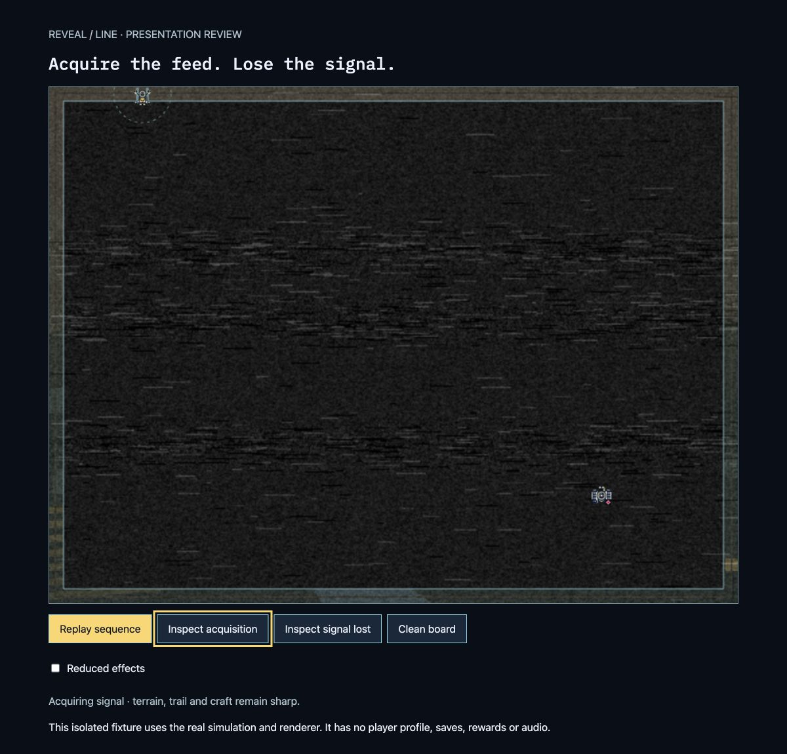
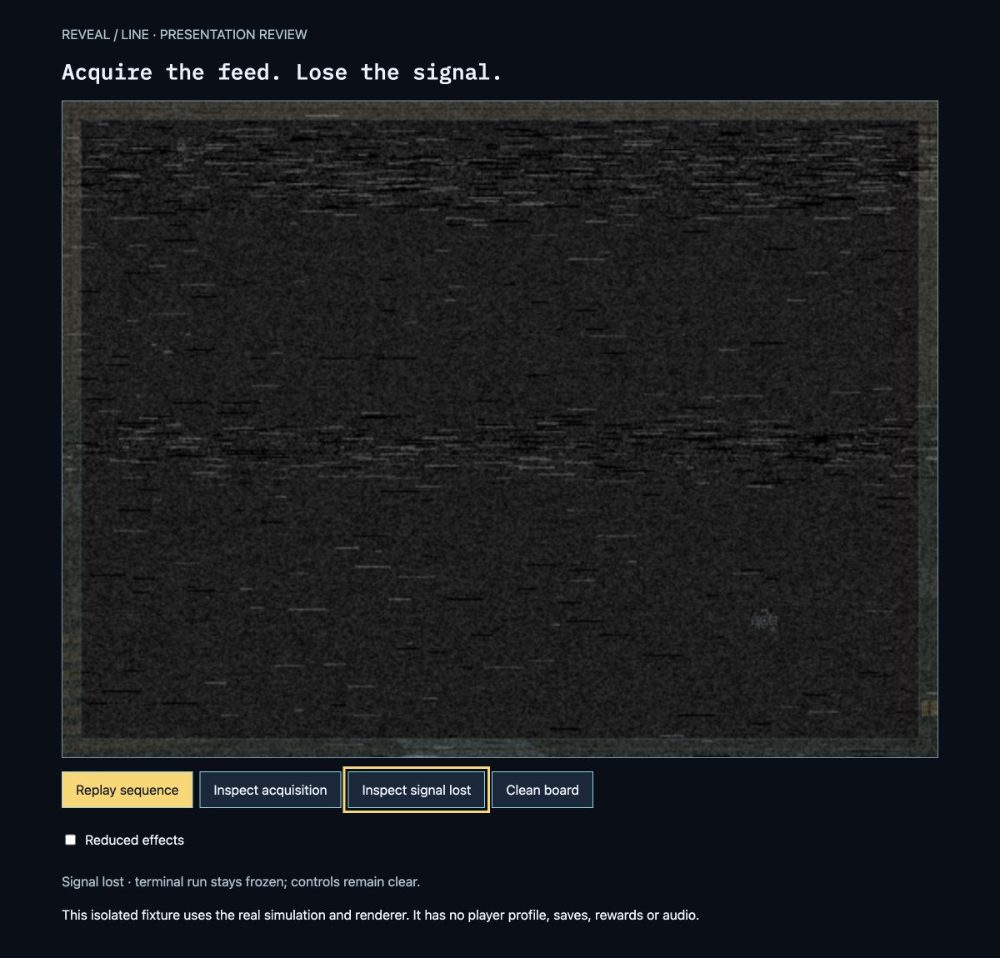
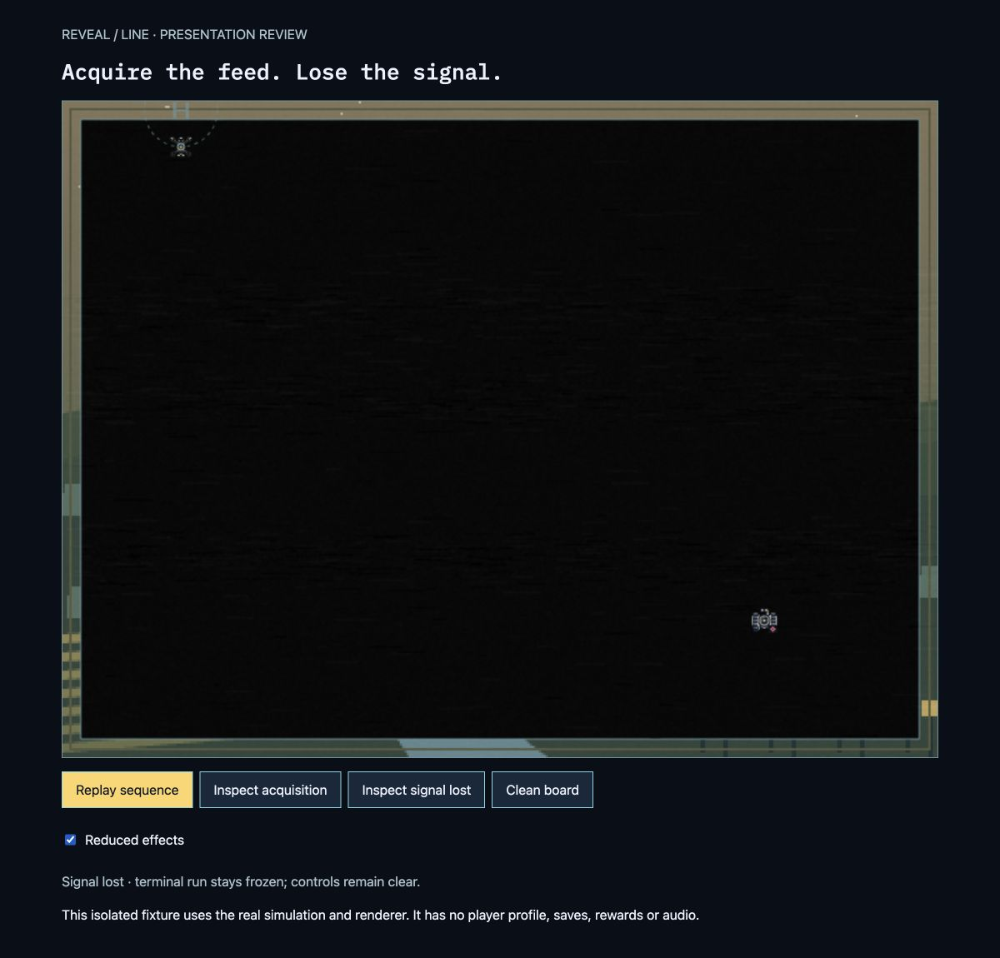

# Flight signal acquisition and loss

Implemented and reviewed on 2026-09-29.

## Behavior

- Actual Start acquires the feed over 550 ms. Monochrome snow clears from the already-masked picture; terrain, actors and live cuts are composited afterward and remain sharp.
- A terminal loss holds the wreck readable for 150 ms, then fades into dim snow by 650 ms. It shares the existing Solo defeat window and adds no gameplay or retry delay. The finished texture holds still.
- Solo/Journey, Company, Versus and Team explicitly opt in. Ready/countdown does not consume acquisition; Pause/Resume freezes and continues it. Restored positive-tick runs do not replay startup. Versus does not invent a failure for a surviving rival at match end.
- Reduced effects skip acquisition and use restrained, static loss shading. Focus loss, dialogs and inactive play stop the presentation clock according to each host's existing rules.
- Demo/replay callers default to off; the existing demo and jammer effects are unchanged. Victory pictures, galleries and DOM controls are unaffected.
- Noise is procedural, cached at a maximum 512-pixel dimension and updated at 12 Hz during the brief transition. It does not read back the board or sample original art. Disposal releases its canvas; failed allocation uses quiet dimming without repeated allocation attempts.

The timings are art direction, not a physically simulated radio model. See [research and recommended follow-ups](analog-flight-references-2026-09-29.md).

## Automated evidence

These are focused cohorts; their counts overlap and should not be summed.

- `node --test game/test/signal-reception.test.mjs game/test/signal-reception-renderer.test.mjs`: **19/19 passed**. Actual legal Solo and Team simulations reach terminal loss. Tests check mask ordering, sharp foreground drawing, terminal composition, paused/settled clocks, transactional preview ownership, disposal and unchanged authoritative state. A Solo recording remains independently replay-verifiable before and after rendering.
- Renderer regression cohort (`signal-reception`, `demo-transition-picture`, `jammer-picture`, `renderer-readability`, `rewards`, `presentation-renderer`, `coop-actor-appearance`): **92/92 passed** before the final three helper lifecycle regressions were added; those final helper changes are covered by the 19-test cohort above.
- Offline/edition/boot inventory cohort: **25/25 passed**. The new module is discovered through the existing runtime import closure, with explicit inclusion assertions.
- Host lifecycle cohort (`node --test --test-concurrency=1 game/test/signal-reception-host.test.mjs game/test/defeat-presentation-host.test.mjs game/test/company-player-lifecycle.test.mjs game/test/content-team-recovery-host.test.mjs`): **22/22 passed**. This covers actual Start/Pause/Resume, the current default Journey entry using released image bytes, Versus countdown, Team terminal/Retry behavior and texture disposal, Company lifecycle, and the existing defeat window across themes. The controller regression follows the established press/hold/release transaction and confirms a held button cannot click through into Retry. Company was rerun after the early-tick restore correction: **7/7 passed**.
- Saved-flight boundary regression (`node --test game/test/signal-reception-restore-host.test.mjs`): **2/2 passed**. Authentic saves at ticks 1 and 30 restore through Continue Saved with the exact replay checkpoint. Neither paused adoption nor Resume draws acquisition; subsequent legal reverse-input self-contact reaches terminal loss and receives the final overlay through the real painter.
- Scoped ESLint, Prettier and `git diff --check` passed for the implementation and manual preview. This does not claim unrelated work in the shared checkout was qualified.

## Browser evidence

The isolated [manual preview](../../game/test/manual/signal-reception.html) uses the actual `BoardPainter`, FPV presentation and core simulation. It exercises legal self-contact inputs to obtain a terminal run; it does not write player progress, rewards or saves. Its controls inspect acquisition, settled loss, reduced loss and the full sequence.

Reviewed in a separate in-app browser tab at a 1200 × 1150 viewport, with no console warnings/errors. The original user game tab was preserved; the review tab was closed and the viewport override reset afterward.

| Acquisition, with sharp craft                               | Settled terminal loss                                       | Reduced effects                                               |
| ----------------------------------------------------------- | ----------------------------------------------------------- | ------------------------------------------------------------- |
|  |  |  |

The canvas integration tests establish draw ordering; the screenshots establish the reviewed browser appearance. This check does not represent physical mobile/controller/native hardware qualification or a long-duration soak.
