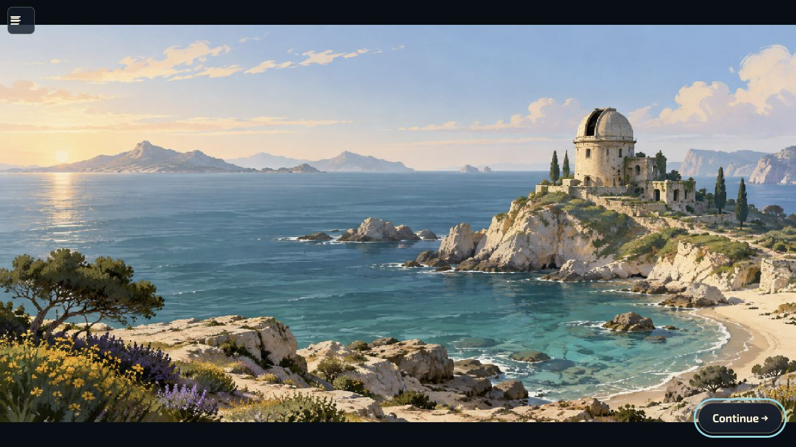

# Completed-picture win presentation

Source verification on 1 October 2026. This is local source evidence, not a public
release or physical-device certification. Design references and timing decisions
are in [the research note](../../research/win-picture-celebration-2026-10-01.md).

## Browser observations

Using the actual local game and normal keyboard controls:

- Earned Stepping stones at 69.5%, then observed the full picture remain after
  the celebration. Continue opened results and focused Next.
- Earned First return at 67.1%, 15,980 points, three lives, displayed time 0:08.
  The full picture remained until Continue. Retry began a fresh attempt and a
  further legal win showed the new reveal/caption before settling again.
- At 1280×720 the completed 2:1 picture occupied 1280×640, centered, without
  stretching or cropping its board framing. The 44×44 menu was reachable above
  the picture; Continue remained visible and focused.
- At 390×844 the full landscape image fit the screen width. At 568×320 it
  occupied 568×284. Both controls remained in bounds. The viewport override was
  reset afterward. These are desktop browser viewport checks, not phone hardware.

The [early reveal frame](celebration.jpg) captures the remaining cover dissolving,
the victory caption and the beginning of the confetti. The
[portrait](portrait-win.jpg), [short landscape](landscape-win.jpg), and
[settled Retry win](settled-after-retry.jpg) captures show the persistent picture.

## Automated checks

- All four new real-host/painter cases passed: normal effects, reduced effects,
  explicit skip, and a held controller Confirm across victory. They check the
  accepted checkpoint and collection bytes, explicit continuation, and no repeated
  celebration when returning through View picture.
- Confetti/rewards/result-picture/combat suites passed (36 checks initially;
  an added real won-combat debris regression also passed in the 18-case combat suite).
- All 72 focused audio, director, campaign and published-audio checks passed.
- All three boot-build checks passed, including reproducible offline inventory
  and desktop/iOS staging. The fixture required its previously omitted launcher
  dependencies; this changed no launcher runtime behavior.
- Global ESLint, localization validation (English/Ukrainian), changed-file
  Prettier and whitespace checks passed.
- Broader host cohorts exercised Journey Next, result preparation/cancellation,
  picture recovery, retained rewards and performance. Release-based controller
  activation expectations were corrected and their focused reruns passed.

Ten unrelated broader assertions remain failing before the new victory flow:
eight catalogue count/selector expectations in default-solo-entry and
mission-library-solo-host (current source has additional missions), and two
Settings-tab navigation expectations in terminal-navigation. Their unrelated
assertions were preserved. Candidate/showcase/actor/optional-world helpers were
updated to explicitly enter results but were not rerun in this pass.

Audio envelopes, routing and controls are verified by test doubles; subjective
listening quality and physical-device sound output remain unverified.
