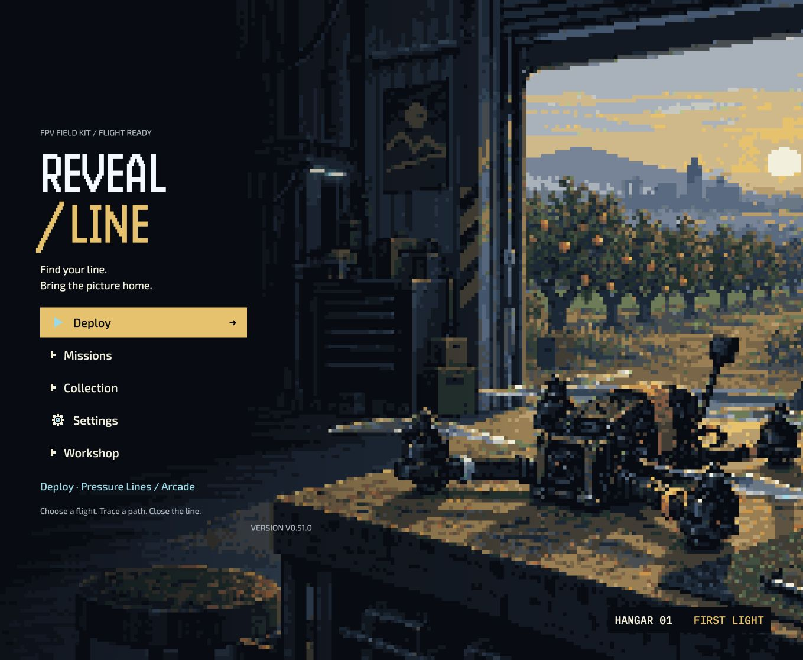
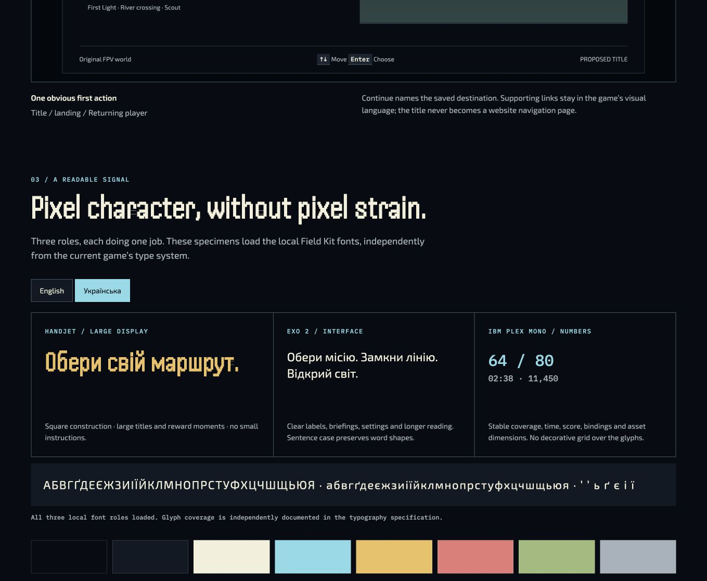
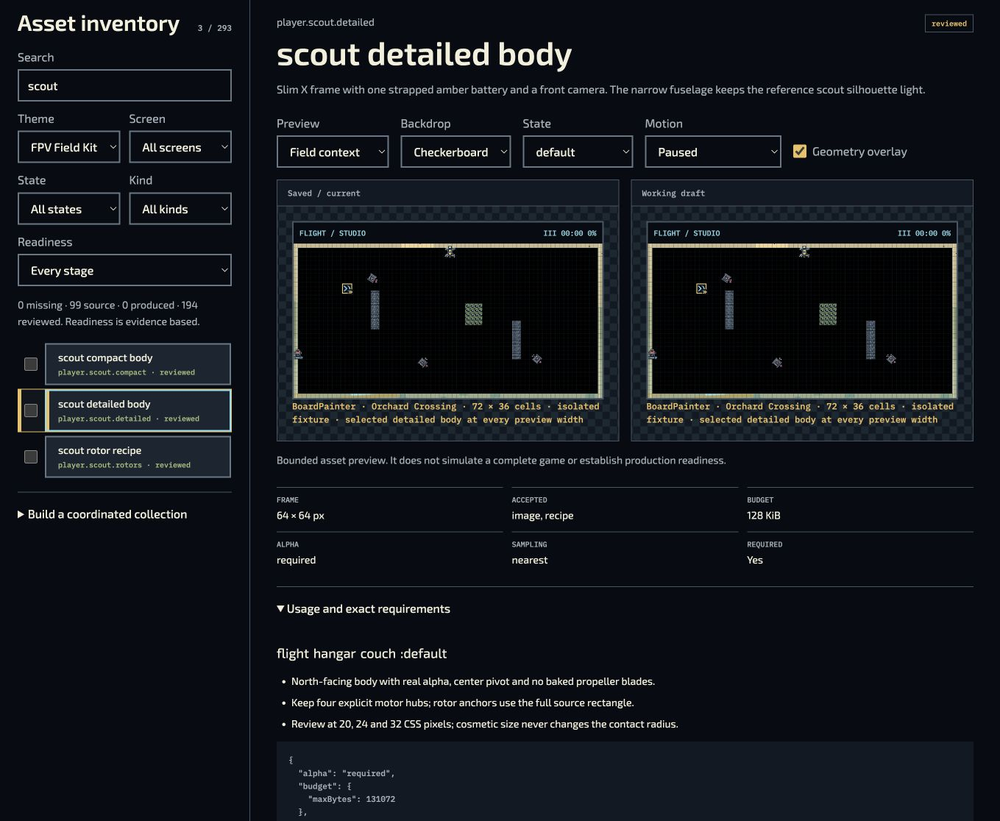

# Reveal Line — FPV Field Kit delivery

**Latest accepted named feature: [v0.61.21 Team earned-picture view](evidence/cross-mode-p07/public-v06121/README.md).** All 3,203 public files / 642,573,907 bytes passed, with two retained automatic retries and no final failures or skips. A real First Connection win, full-picture view, Back/Escape with unchanged results, Plain/Large portrait and landscape, and fresh Retry passed. P07/P10/P18 and the complete game remain open. [Current phased plan and immediate queue](evidence/cross-mode-p07/public-v06121/planning/progress-and-next.md).

**Next public delivery: [v0.61.22 actor size and edge visibility](evidence/cross-mode-p08/actor-v06122-publication/README.md).** Its exact source, 5,922 tests per Node family, original release assets and scoped source-native review passed. The release is published Latest; Pages/public acceptance is pending. [Updated phase order and remaining work](evidence/cross-mode-p08/actor-v06122-publication/planning/progress-and-next.md).

The [v0.61.20 partial public review](evidence/cross-mode-p03/public-review-v06120/README.md) and [v0.61.21 publication preparation](evidence/cross-mode-p07/team-picture-v06121-publication/README.md) remain historical records. [Archive27 append](../evidence/archive-27/append-v06120/README.md) retains v0.61.9 and v0.61.20 with accepted bytes and scoped keyboard retention; their phone focus limitations remain open. The new plan requires all-history publication before the 101st major-0 catalogue entry; the prepared v0.61.22 catalogue contains 93/100 entries.

The [original publication preparation](evidence/cross-mode-p03/enemy-startup-v06120-publication/README.md) and [v0.61.9 partial review](evidence/cross-mode-p05/public-review-v0619/README.md) retain their historical scopes. [Archive27](../evidence/archive-27/initial-v0619/README.md) retains v0.61.9 with complete bytes and scoped navigation, including its unresolved picker-outline failure.

**Prior scoped accepted baseline: [v0.61.8](https://mekhovov.github.io/revealline/releases/v0.61.8/site/game/).** Its [accepted Standard picker-clearance report](evidence/cross-mode-p05/public-v0618/README.md) and all earlier reports keep their original scopes. The [original v0.61.9 publication record](evidence/cross-mode-p05/reading-v0619-publication/README.md) remains a preparation-time record; actual deployed-byte and partial native results are recorded separately above. [Archive26 retention](../evidence/archive-26/append-v0618/README.md) preserves v0.61.7 and v0.61.8 within its accepted byte and native scope.

The later [cross-mode P00 audit and delivery record](evidence/cross-mode-p00/README.md) tracks the approved Solo, Versus and Team redesign. It identifies unfinished Team artwork, actor/objective integration and responsive controls, plus Versus artwork-resolution gaps. The historical v0.51 report below retains its original scope and evidence; its registry-completeness statements do not establish the new P08-A cross-mode acceptance.

**The FPV Field Kit redesign is delivered as v0.51.0.** All eight phases have versioned releases, and the final frozen game has passed source, public-file and browser qualification. This report records the implemented scope, test evidence and remaining limits.

[Play v0.51.0](https://mekhovov.github.io/revealline/releases/v0.51.0/site/game/) · [Asset Studio](https://mekhovov.github.io/revealline/releases/v0.51.0/site/authoring/asset-studio/) · [Design atlas](https://mekhovov.github.io/revealline/releases/v0.51.0/site/authoring/design-atlas/) · [Immutable release](https://github.com/mekhovov/revealline/releases/tag/v0.51.0)

The game now uses one FPV field-kit identity across its title, mission gallery, preparation, flight HUD, pause/results, Collection, settings, game data, learning, Couch play, replay and authoring pages. Original hangar scenes, drone bodies, semantic glyphs and reveal pictures follow the shared ink/cyan/amber palette. The main menu prioritizes Deploy or a named Continue destination; device hints, selection states and return focus use the existing navigation infrastructure.

Handjet supplies large display lettering, Exo 2 handles interface text, and IBM Plex Mono keeps counters aligned. The actual shipped fonts were checked for English and Ukrainian glyphs, including Ґґ Єє Іі Її. Standard/Large text preferences remain available. Ukrainian translation is prepared for but has not been supplied.

The final presentation collection is **revision 13: 194 reviewed required slots, 99 optional historical source slots, zero missing required slots**. Its original production covers 30 sprites, 45 semantic glyphs, two title compositions, and 44 prepared reveal exports from 38 distinct compositions for 56 currently supported owners. Reviews are explicit agent reviews with revision evidence; they are not claims of physical-device or human certification. Historical artwork and supplied Xposed references remain preserved.

The local Asset Studio provides slot requirements, native/enlarged/transparency previews, a real board fixture, current/draft comparison, upload and preparation tools, palette/geometry editing, a single-layer sprite editor, undo/redo, immutable revisions, and atomic `.rltheme` import/export. Generated briefs include the selected theme, exact dimensions, current revision, locked geometry, affected screens, provenance and validation requirements. Uploads remain local drafts until a validated bundle is adopted into a release. Player saves and the existing media database remain separate.

The theme compiler resolves defaults, theme, collection and draft overrides. Gameplay modes, content themes and presentation collections remain distinct. FPV is complete; new Ukrainian, Retro and Coupa art collections can use this contract later. Large illustration painting and multilayer animation authoring remain external-editor work, as agreed.

| Phase | Release for testing                                                                     | Delivered feature                                         | Frozen source  |
| ----- | --------------------------------------------------------------------------------------- | --------------------------------------------------------- | -------------- |
| 0     | [v0.44.0](https://mekhovov.github.io/revealline-archive-06/releases/v0.44.0/site/game/) | Baseline, reference audit and interactive design atlas    | `fc789c71aa21` |
| 1     | [v0.45.0](https://mekhovov.github.io/revealline-archive-07/releases/v0.45.0/site/game/) | Readable fonts, tokens and shared controls                | `adacdfbe1535` |
| 2     | [v0.46.0](https://mekhovov.github.io/revealline-archive-07/releases/v0.46.0/site/game/) | Asset registry, compatibility adapters and theme compiler | `0b0d2d793d61` |
| 3     | [v0.47.0](https://mekhovov.github.io/revealline-archive-08/releases/v0.47.0/site/game/) | Local Asset Studio and bundle workflow                    | `f4672a915e94` |
| 4     | [v0.48.0](https://mekhovov.github.io/revealline-archive-08/releases/v0.48.0/site/game/) | Title, mission gallery and preparation                    | `028ead24cfb3` |
| 5     | [v0.49.0](https://mekhovov.github.io/revealline-archive-09/releases/v0.49.0/site/game/) | FPV actors, terrain, effects, HUD and reveal artwork      | `8af0d47d73e8` |
| 6     | [v0.50.0](https://mekhovov.github.io/revealline-archive-09/releases/v0.50.0/site/game/) | Remaining game screens and supporting tools               | `d52b634a231c` |
| 7     | [v0.51.0](https://mekhovov.github.io/revealline/releases/v0.51.0/site/game/)            | Complete slot review, compatibility and qualification     | `5d4bd9871895` |

Each phase has a versioned commit, immutable tag/release and test URL. Related instructions and AI prompt examples were updated with the implemented contracts, including the [asset-creator skill](../../../authoring/skills/xonix-asset-creator/SKILL.md) and [theme-designer skill](../../../authoring/skills/xonix-theme-designer/SKILL.md). The [execution register](../../../docs/fpv-redesign-execution.md) preserves the source and release history; [the Studio guide](../../../docs/asset-studio.md) describes authoring. The final evidence-only commit does not change the game version or republish its frozen files.

The immutable final game source is `5d4bd98718955fa471fe71d798715864af166d18`, tree `37331db1a89526aedffd25ae979b7378a1a707fc`. Its [six source gates and 3,691 tests](https://github.com/mekhovov/revealline/actions/runs/34898406470) passed with zero skipped tests. Production reproduction and the required-slot ledger passed. The separate [integration run](https://github.com/mekhovov/revealline/actions/runs/34908635748) passed all six gates, 3,695 tests and the ordinary build before [PR31](https://github.com/mekhovov/revealline/pull/31) merged. Source qualification, hosted freezing and independent TAR/ZIP verification have separate recorded identities; they are not interchangeable checks. The final publication merge also preserves the later audio/explorer source changes and their v0.51.1 version fields. This redesign receipt qualifies frozen v0.51.0, not that later audio release.

All earlier phase editions passed their recorded public play/save/Collection and offline journeys. Archive09's full audit checked **1,181 files / 618,354,051 bytes** for v0.49/v0.50 with zero failures, retries or skips. Both editions passed actual loss/Retry, saved continuation, offline new-document navigation and separate checkpoint coexistence. v0.50 also passed independent Couch keyboard rounds and return to its solo save. Public v0.51 supporting checks passed the title, Workshop/Guide return focus, reviewed Studio inventory, completed board preview, Ukrainian specimens and return to the game. The [final v0.51 browser receipt](evidence/public-qualification/v051/receipt.json) passes fresh offline documents, saved continuation, loss/Retry, Collection, core-only Couch/Studio and installed-R5 solo/Couch recovery. Both installed Couch boards reached 51.5% / 12,060 points; the independent solo checkpoint remained at 2:57 with three lives. Both QA pages were [restored online while paused](evidence/public-qualification/post-test-network-restore.json).

The first fully audited public v0.51 deployment, workflow `34912816014` / deployment `6449074969` / controller `5f905b1`, passed every one of **2,170 files / 656,572,716 bytes**, including all 614 frozen distribution files. The final admitted controller `2b8521b0a118df8663f93de5500e14da11741407` then published through [workflow 34918140908](https://github.com/mekhovov/revealline/actions/runs/34918140908), deployment `6449937007`. Its [fresh full public audit](evidence/final-main-public-audit/runs/main2b8521-complete-1/byte-admission.json) and [independent row review](evidence/final-main-public-audit/runs/main2b8521-complete-1/independent-row-review.json) verified all 2,170 files / 656,572,716 bytes again. One 300-second R2 transport timeout and its successful retry are retained; no unchanged-body reuse was needed. All canonical game/UI/asset bytes remain exact, while the archive routing classification is fully admitted. The native receipt predates this final full-byte result and preserves its earlier publication-status wording. The final policy preserves all 57 release records, up to 100 per semantic major, and routes historical editions to their admitted immutable archives. Existing release bodies and tags are unchanged.

The 21 audited simulation-core files, totaling 187,102 bytes, exactly match the v0.43 baseline. The current presentation bodies comprise 124 files / 2,304,880 bytes; the full compiled directory, including retained history and metadata, has 131 files / 7,917,403 bytes. This corrects an earlier working-source phase-7 size note. The frozen distribution contains 614 files / 322,902,417 bytes. These inventories are distinct from the offline core cache. The public v0.51 persistent profile verified all 568 core files / 65,925,650 bytes, with no missing or corrupt entries; build `5c3e497093e4901e859378806e57f2c8fe71b1499a7792abe86a9053735e3700`. That leaves 1,183,214 bytes within the unchanged 64 MiB core budget. The separately completed browser receipt covers the corresponding offline journeys.

The uncompressed source title response bodies increased from 4,034,299 to 6,543,851 bytes (**+62.21%**). Sampled `BoardPainter.draw` p95 was 0.4–0.6 ms and rAF p95 16.7–16.8 ms on desktop Chromium. These are localhost CPU-submission measurements, not public transfer speed, GPU completion, input latency or physical-device performance. Legacy originals and duplicate font URLs still contribute startup cost. Existing offline, asset and Pages budgets were retained. R5 remains an optional 11,708,176-byte original pack; core-only and installed-pack recovery are separate acceptance cases.

Earlier installation-interface timeouts, failed attempts and local disk-pressure observations remain in the evidence. Successful retries do not erase them. One v0.51 attempt lost its temporary browser profile when Chrome was replaced; the replacement is observed, its cause is unknown, and this is not accepted as save/offline persistence or proof of game-driven deletion. The retry uses a dedicated persistent QA profile. A later observed Chrome replacement retained that profile, its core cache, installed R5 original, Large preference and paused R5 flight; ordinary offline Continue restored the exact checkpoint. The replacement cause remains unknown, and this is distinct from a deliberate clean-restart test. A Couch selection changed while an installed-library refresh was still running invalidated the pending registry and left stale “Checking” text; one ordinary Refresh with no concurrent selection recovered the three installed maps, their original picture and successful offline play. This recoverable edge case remains documented. Studio's first board preview had a visible loading delay before successful rendering. The v0.51 prompt Copy action was invoked, but that supporting check did not observe clipboard contents or eventual confirmation; the separate v0.50 confirmation and source tests remain their own evidence.

The old v0.42 comparison route now reaches immutable Archive10. Its Continue entry still reports a missing campaign pack that already occurred before this redesign's cutover. No successful migration or restoration of that old flight is claimed, and its storage was not replaced to manufacture a pass.

Physical phones/tablets, Safari/WebKit, real gamepads, multitouch/audio hardware, OS installation, a controlled full browser-process restart and long-term storage retention remain unverified. Viewport, network and controller modeling are identified as emulation. Full Ukrainian translation, new Ukrainian/Retro/Coupa art collections, hosted administration and gameplay-rule changes remain the agreed deferred scope.

The [machine-readable delivery register](delivery.json) records the exact game and deployment identities. The [evidence index](evidence-index.json) pins each included artifact. Historical pending-at-review statements and failed attempts remain intact; final acceptance comes from the completed source, public-byte and native receipts linked above. Browser profile/database/cache files are not included.
