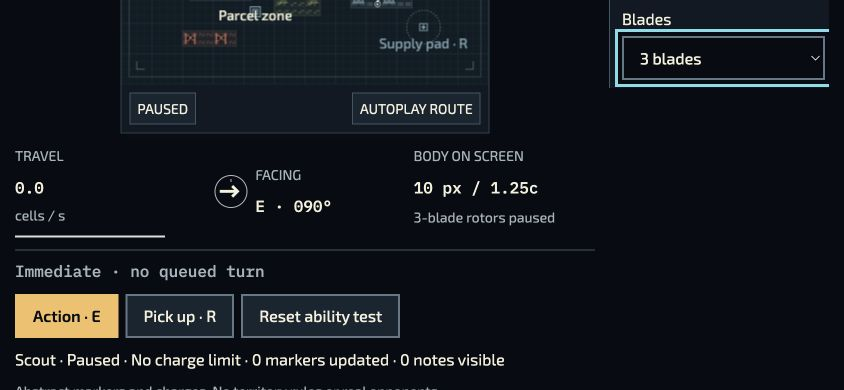
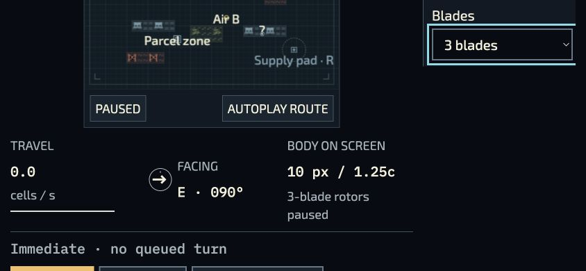
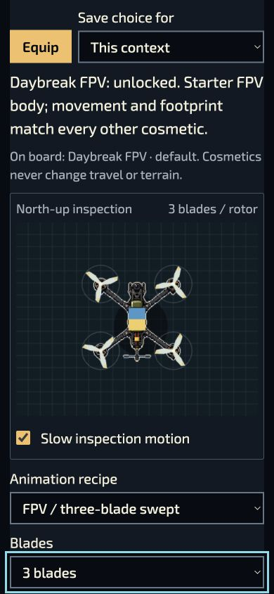

# v0.61.7 public Motion Lab observations

The [original observation record](observations.json) contains six actual browser cases: Standard and Large text each pass portrait → landscape → portrait while the blade-count control stays focused at value 3 and the preview stays paused. The original [manifest](manifest.json) pins all seven screenshots and the observation record. The [root review](../root-native-review.original.json) records its independent checks.

The right edge of the focus outline remains a known limitation. Return to the game and browser Back used the immutable v0.61.7 routes; Back initialized the preview afresh, so it was paused again using its visible control. No Solo attempt, storage change, physical-device/controller, offline, listening or complete keyboard-only journey is claimed. Original captures have not been resized or edited.
