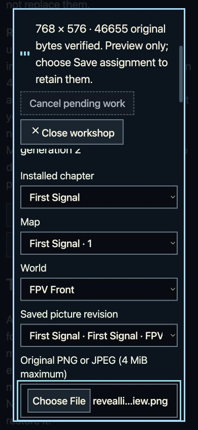

# v0.61.9 public review — verified bytes, native focus gate open

**The deployed bytes are accepted; full feature and native acceptance remain incomplete.** The [root scoped result](root-public-review.original.json) accepts all **3,153 files / 642,265,836 decoded bytes** and the fresh release/deployment authorities. The public Large/Plain picker retains focus and draft state, but approximately **1.77 CSS pixels of its external focus outline are clipped after landscape → portrait**. No parent phase closes. [v0.61.8 remains the prior scoped accepted baseline](../public-v0618/README.md).

[Play v0.61.9](https://mekhovov.github.io/revealline/releases/v0.61.9/site/game/) · [Still Media](https://mekhovov.github.io/revealline/releases/v0.61.9/site/authoring/still-media/) · [Immutable release](https://github.com/mekhovov/revealline/releases/tag/v0.61.9) · [Current plan and next gates](planning/progress-and-next.md)

## Exact publication and byte review

The game source is `6db978db40287151489803e915cb4ecb9ea232ee`, tree `50391b01ad011079c9ba66fe7e4f9f0ed229a1f9`. Release `391596705` retains all nine immutable asset descriptors. Publisher PR 142 merged as `b88b0e4c63dddcc5339076e29606b2fb1700553f`, tree `9456449f0b6ea304c6d2c3ba2b590782e6e3a484`. Actual push Pages run `35370220934`, attempt 1, completed successfully; deployment `6528856630` and status `18534250830` identify this production site. The PR preview is not the production authority.

The [complete HTTP report](public-http-report.original.json) records 3,154 attempts, one recovered HTTP 503 and one retry, with zero final failures or skips. The recovered request was the historical bridge `releases/v0.61.5/site/authoring/still-media/index.html`. Both attempts remain in the originals. The [independent row review](independent-public-review.original.json) reconciles every final result and attempt with the bound URL, MIME category, size and SHA-256. It also checks all nine release assets and the 89 unchanged prior catalog entries. That is catalog and current deployed-byte evidence; it does not claim a new historical HTTP-body preservation audit.

The [post-HTTP authorities](after-http-authorities.original.json), refreshed at 16:54:21Z on 18 September 2026, confirm unchanged source, tag, published release, Latest, current main, successful run and deployment. Root retained the reviewed strict intake, its one approved receipt download and the successful binding check. The receipt contains the exact inventory used by this audit. [Archive26's accepted append](../../../../evidence/archive-26/append-v0618/README.md) separately retains v0.61.7 and v0.61.8.

## Observed reading and navigation scope

The [native original](native-review.original.json) and [root native review](native-root-review.original.json) record ordinary public navigation into Still Media with Large/Plain already selected. An owned PNG preview and unsaved filename, credit, source and description survived 390×844 → 844×390 → 390×844 rotation and an actual cross-tab Settings change. The already-open editor adopted Standard/Theme and then Large/Plain without reload or injected application state. Escape and Close returned to the opener; Back returned to the exact v0.61.9 Home route.

The [typography transcription](typography-addendum.original.json) records Standard/Theme body and dialog at 18 px, picker and label at 16 px with 21.6 px line-height; Large/Plain body and dialog at 22 px, picker and label at 20 px with 27 px line-height. Dialog line-height is 27 px and 33 px respectively; body line-height was not recorded. Theme computed family lists contain the two `RLAsset` families and Field Kit Mono, while Plain uses the system-ui stack. These are computed CSS family lists, not proof of the font face supplying each glyph or complete glyph coverage. The internal `pixel` preference value does not certify pixel-shaped glyphs.

Visible saved counts remained two records, two revisions and generation two. No assignment Save, restore, authored-picture use, story or gameplay start, or storage clearing was performed. Opening the media store may upgrade its schema, so unchanged visible counts do not prove zero database writes or byte-level save preservation. This was mixed keyboard/pointer interaction, not physical-device, screen-reader, zoom, offline or full-input qualification. Four natural-size desktop captures differ from the recorded DOM viewport and are retained as context only, not geometry evidence. The initial style-label lookup timeout and its fresh accessibility-state recovery also remain retained.

## Required focus failure

On return to 390×844, the picker bottom is 819.765625 px. Its 3 px outline and 4 px offset extend to 826.765625 px, beyond the dialog's **inner scrollport bottom of 825 px** by 1.765625 px. The outer border bottom of 828 px is not the visible scrollport boundary. Draft, preview and focused-element identity survived; the required complete-outline quality gate did not.

The retained [focus research](focus-research.original.md) distinguishes this project's stricter complete-outline gate from WCAG Focus Not Obscured (Minimum). This observation is not proof of a WCAG minimum violation. Root accepted public bytes only, with `fullFeatureAccepted`, `fullNativeAcceptance`, `phaseAccepted` and `fullGameAccepted` all false.

A separate source-preview helper correction passed nine rotation cases; its [original scope](queue/picker-successor-native-review.original.json) and [manifest](queue/picker-successor-native-manifest.original.json) remain distinct from public v0.61.9. The coordinator has composed it on actor source `17e0a455` for planned v0.61.23; at this report cutoff the candidate is uncommitted and composed checks are running. It does not repair the immutable v0.61.9 release. The [shared-consumer source-preview addendum](queue/shared-consumers-review.original.json) separately records forward-Tab horizontal mission-card clipping and 11 px Replay JSON under Large/Plain. These are open P03/P05 backlog findings, not additional demonstrated public v0.61.9 failures or a proven regression from the narrow helper. The horizontal follow-up has a separate owner; no Replay CSS change is bundled here.

## Retained evidence

[Originals ZIP](originals.zip) and [exact index](originals-index.json) retain 250 unique original paths, 9,500,278 expanded bytes. The ZIP is 2,676,476 bytes, SHA-256 `deb9a6d3ad6746216db3885f8dcebc485f1570a937b7464b8ccf8b2f804136ca`. It includes every HTTP result and attempt, executed helpers and bindings, receipt/authority originals, failed/recovered attempts, the sealed native packet and typography addendum, and the separate actor/capacity queue originals. No game payloads or duplicate source-qualification package were added. Small queue follow-up reviews/manifests are copied separately with exact pins; their source-preview raw-image pointers do not become public acceptance evidence.

This documentation changes no game source, release payload, version, selector or archive admission. Earlier reports retain their original scopes. The next gates are the corrected focus candidate's exact-source qualification and affected public journeys, then the remaining navigation, readability, creation-capacity, artwork, content and physical-device work in the current plan.
